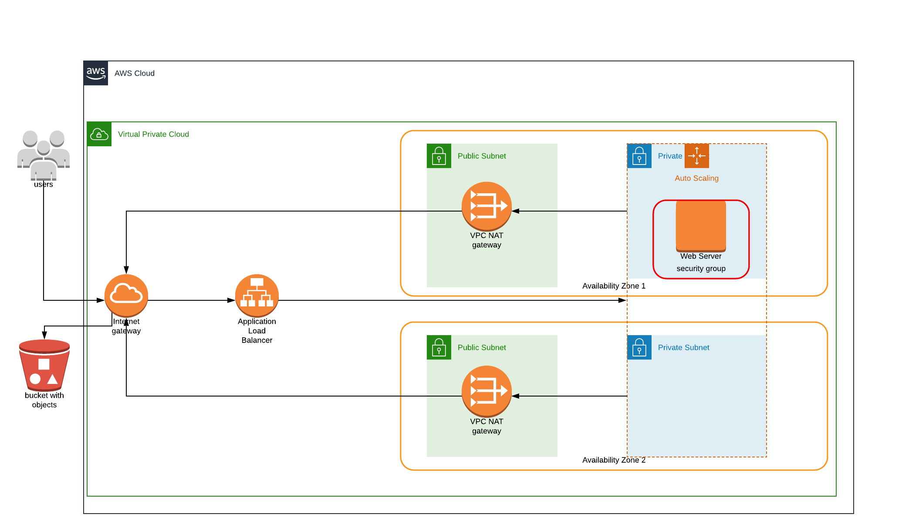

# Deploy a High-Availability Web App using CloudFormation

This template was created as part of the [Udacity Cloud DevOps Nanodegree Program](https://www.udacity.com/course/cloud-dev-ops-nanodegree--nd9991)
The template included will launch 4 EC2 instances running the Udagram App on Apache.

The application consists of 3 stacks, running the following commands in this order will create the stacks.

1. `$ ./create.sh udagram network.yml network-parameters.json`
2. `$ ./create.sh udagram-iam iam.yml iam-parameters.json`
3. `$ ./create.sh udagram-servers server.yml server-parameters.json`

_`create.sh` requires [aws-cli](https://aws.amazon.com/cli/) to be configured. The stacks will be created in `us-west-2`_
### The Basics
- Parameters
    - Network
        - ProjectName
        - VpcCIDR
        - PublicSubnet1CIDR
        - PrivateSubnet1CIDR
        - PublicSubnet2CIDR
        - PrivateSubnet2CIDR
    - IA
        - ProjectName
    - Server
        - ProjectName
        - MinimumWebServerInstances
        - MaximumWebServerInstances
        - WebServerVolumeSize
- Resources
    - Network
        - VPC
        - Subnets
        - NatGateways
        - ElasticIPs
        - InternetGateway
    - IAM
        - Role
        - InstancePolicy
    - Server
        - LoadBalancer
        - Launch Configuration
        - Autoscaling group
        - Security Groups
        - Listeners
        - Target Groups
- Outputs
    - Network
        - Subnets
        - VPC
    - IAM
        - InstancePolicy
    - Server
        - LoadBalancer Name